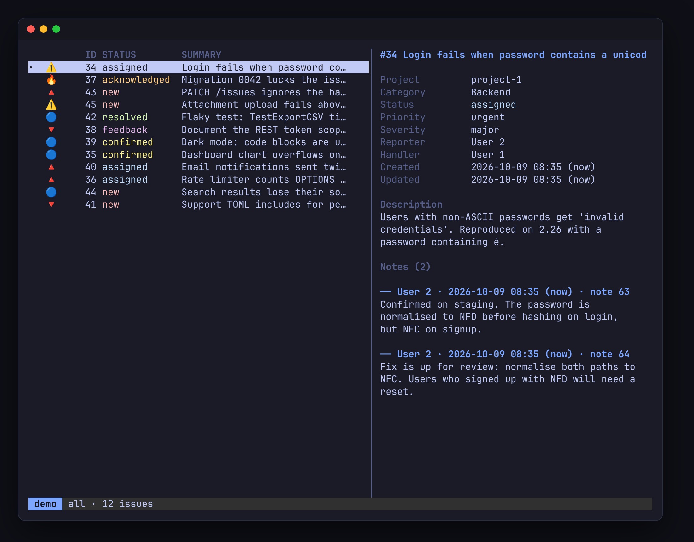

# mantis-tui

A fast terminal UI and scriptable CLI for the [MantisBT](https://mantisbt.org) bug tracker.



## Features

**TUI**
- Browse, filter, sort, search and group issues
- Split view with a live preview of the issue under the cursor
- Multiple Mantis hosts, switch with `H` or the number keys
- Change status, priority, severity, category, summary and assignee
- Batch edit a selection of issues
- Write notes and descriptions in `$EDITOR`
- Attach files or a clipboard screenshot to notes and new issues
- Inline image thumbnails in kitty, Ghostty and WezTerm
- `<pre>` blocks in descriptions and notes shown as syntax-highlighted code, with tidy MySQL console output
- Unread markers for issues that changed since you last looked
- Desktop notifications for new issues on every host
- Command palette with jump to any issue by number
- Related and mentioned issues, one key away
- Mouse support
- [herdr](https://herdr.dev) integration: open an issue or ask Claude about it in a new pane

**CLI**
- Every TUI action as a one-shot command
- `--json` output and stable exit codes
- Statuses, priorities and users taken by name, validated against the server
- Built for scripts and AI agents

**Safe by default**
- Tokens are never printed or sent across redirects
- Deletes ask first
- Unsent notes are kept in a temp file

## Install

Requires Go 1.26+ and MantisBT 2.24+ with the REST API enabled.

```sh
go install github.com/whleucka/mantis-tui/cmd/mantis-tui@latest
```

Or build from source:

```sh
git clone https://github.com/whleucka/mantis-tui
cd mantis-tui
make build   # bin/mantis-tui
```

## Setup

1. In Mantis, open **My Account → API Tokens** and create a token.
2. Export it in your shell profile:
   ```sh
   export MANTIS_WORK=your-token
   ```
3. Create `~/.config/mantis-tui/config.toml`:
   ```toml
   [[hosts]]
   name = "work"
   url  = "https://mantis.example.com"   # without /api/rest
   env  = "MANTIS_WORK"
   ```
4. Run it:
   ```sh
   mantis-tui          # TUI
   mantis-tui hosts    # check your hosts are active
   ```

Press `?` in the TUI for the keys on the current screen.

All options (filters, sorting, preview layout, code theme, notifications, icons) are in [docs/usage.md](docs/usage.md#configuration).

## CLI

```sh
mantis-tui list --filter assigned
mantis-tui show 1234 --notes
mantis-tui update 1201 1202 --status resolved
mantis-tui assign 1234 alice
mantis-tui note 1234 -m "Fixed in abc123" --clipboard
git log -1 --format=%B | mantis-tui note 1234 -
mantis-tui download 1234 -o /tmp/1234
mantis-tui show 1234 --json | jq '.issues[0].status.name'
```

Full command list and exit codes: [docs/usage.md](docs/usage.md#cli).

## Using it with AI agents

The CLI is designed to be driven by coding agents such as [Claude Code](https://claude.com/claude-code):

- Readable output by default, the server's raw JSON with `--json`
- Exit codes an agent can branch on (not found, auth failure, bad value)
- Invalid values fail with the list of valid ones, so agents don't guess
- `download` saves attachments, so an agent can read screenshots on an issue
- Tokens never appear in output

[docs/mantis-agent.md](docs/mantis-agent.md) is a ready-made Claude Code agent. Copy it to `~/.claude/agents/mantis.md` and ask Claude things like "what's on my plate in Mantis?" or "post a note on #1234 with the fix". It reads freely and confirms every write with you first.

In the TUI, `A` opens Claude Code on the current issue in a new herdr pane. The command is configurable with `issue.ask`.

## Contributing

Contributions are welcome. Open an issue or a pull request.

```sh
make test   # unit tests
make race   # race detector and coverage
make lint   # golangci-lint
```

`go run ./cmd/mantis-devserver` starts an in-memory Mantis server with sample data, so you can test without a real tracker. See [docs/usage.md](docs/usage.md#development).

AI-assisted contributions are fine. This project is built with help from Claude Code. You are responsible for any code you submit: read it, test it, and keep changes focused.

## License

[MIT](LICENSE)
